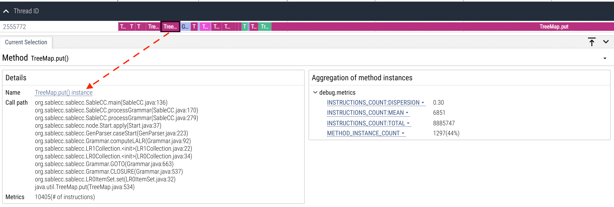

# Manual

## Table of Contents

1. [Operating Environment Check](#1-operating-environment-check)
2. [Online Tracer](#2-online-tracer)
3. [Offline Data Processor](#3-offline-data-processor)
4. [Web-based GUI](#4-web-based-gui)
5. [Optimization Loop](#5-optimization-loop)

---

## 1. Operating Environment Check

Before running Trace4J, ensure the hardware components are properly configured.

### Preparation Steps

* Ensure **PMU** and **hardware breakpoint** features are available on your system.
* In containers or restricted environments, verify `perf_event_open` is permitted.

### Environment Verification

To check permissions and system capabilities:

```bash
sudo sysctl kernel.perf_event_paranoid
```

Make sure `perf_event_paranoid` <= 1.

If required, adjust permissions temporarily:

```bash
sudo sysctl -w kernel.perf_event_paranoid=1
```

---

## 2. Online Tracer

### Overview

The **Tracer** can attach to a running Java program or launch a Java program and dynamically collect execution traces using **PMUs** and **breakpoints**. It offers flexible configuration to control the sampling rate and the number of post-sample function instances.

### Features

* Attaches to a running Java program or launches a new one from stratch.
* Samples function calls using the PMU call event (`BR_INST_RETIRED.NEAR_CALL`).
* Intercepts function returns through hardware breakpoints for function instance-level performance tracing.
* Configurable tracing depth — traces a user-adjustable number of function instances following each function sample.

### Usage

#### Attach to An Existing Java Process

```bash
./run_attach.sh <running time in seconds> <pid>
```

#### Launch with Trace4J Supervision

```bash
java -agentpath:$Trace4J_HOME/build/libagent.so=VARIANCE::BR_INST_RETIRED.NEAR_CALL@<sample_rate>,<perf_event> <your_program>
```

#### Runtime Requirements

* Ensure `perf_event_open` is enabled.
* Verify the target Java process allows `JVMTI` attachment.

---

## 3. Offline Data Processor

### Purpose

The **Data Processor** standardizes performance metrics collected by the **Tracer** into two formats: granular and aggregate formats.

### Command Example

```bash
python3 offlineprocess/process_raw_data.py
```

### Operations

* Associate metrics with function call paths.
* Export data for visualization.

### Output

* `.pftrace` — the structured trace format for GUI visualization.

---

## 4. Web-based GUI

### Overview

The **Web-based GUI** provides an interactive environment for exploring and analyzing trace results. It is built atop **Perfetto UI**, offering hierarchical and temporal insights into Java function instance-level performance.

### Launch GUI

```bash
./scripts/GUI.sh
```

Then open your browser at:
[http://127.0.0.1:8888](http://127.0.0.1:8888)

### Interface Layout

1. **Timeline Pane (Top):**
   Displays function execution instances as rectangles ordered chronologically.
   Each rectangle’s length is proportional to its metric value (e.g., `PERF_COUNT_HW_INSTRUCTIONS`).

2. **Details Pane (Bottom Left):**
   Shows metadata of a selected function instance — name, call path, and performance metrics.

3. **Aggregate Pane (Bottom Right):**
   Displays aggregated statistics:

   * Total, mean and dispersion of metric values
   * Instance counts

### Example

Example: profile a [SableCC](https://sablecc.org) workload.

```bash
java -agentpath:$Trace4J_HOME/build/libagent.so=VARIANCE::BR_INST_RETIRED.NEAR_CALL@100000,PERF_COUNT_HW_INSTRUCTIONS,100 -jar sablecc.jar java-1.5.sablecc
python3 $Trace4J_HOME/offlineprocess/process_raw_data.py
./$Trace4J_HOME/perfetto/ui/run-dev-server
```

View the generated .pftrace file in the GUI:



---

## 5. Optimization Loop

Trace4J supports iterative optimization and validation.

a. Map results to source code functions.

b. Identify hot functions whose per-instance performance shows significant dispersion.

c. Apply optimizations (e.g., replace linear search with hashmap lookup).

d. Rebuild, rerun Trace4J.
