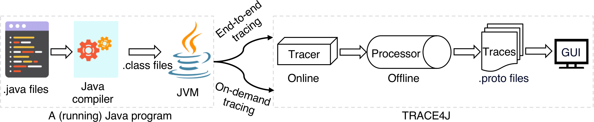

# Preface

**Trace4J** is a lightweight, flexible, and insightful performance tracing tool for Java, designed to bridge the gap between Java source code and its execution behavior on modern CPUs.
It seamlessly integrates **CPU hardware facilities (PMUs and breakpoints)**, **JVM Tool Interface (JVMTI)**, and the **Linux perf_event** subsystem to deliver accurate and low-overhead runtime tracing for Java programs.

Trace4J requires no modifications to the Linux kernel, JVMs, or traced Java programs, supporting both **end-to-end** and **on-demand** tracing. This makes Trace4J suitable for both **development debugging** and **production performance analysis**.

---

## Key Features

### Lightweight

Combines hardware performance monitoring units (PMUs) and breakpoints to trace dynamic function instances with ≤ 5 % time and memory overhead.

### Flexible

Offers a user-adjustable monitoring length following each sampled function instance by resolving branches along the way, enabling users to balance tracing accuracy vs. overhead.

### Insightful/Accurate

Collects rich and accurate function-level attribution of microarchitectural behavior, such as CPU cycles, cache hits/misses, and retired instructions, aimed at delivering acitionable optimization insights.

### Visualization

Provides an intuitive, Perfetto-based web GUI to visualize function timelines, call paths, and performance metrics.

---

## Design Overview

As illustrated in the following diagram:

Trace4J consists of three main components:

### 1. Online Tracer

* Attaches to a (running) Java program.
* Samples function calls via PMUs and intercepts returns via hardware breakpoints.
* Offers a user-adjustable number of function instances following each function sample.

### 2. Offline Data Processor

* Converts raw traces into **granular** and **aggregate** formats.
* Supports statistical analysis such as **mean**, **dispersion**, and **coefficient of variation**.

### 3. Web-based GUI

* Built atop **Perfetto UI**.
* Allows users to navigate traces, inspect function instances, and analyze hotspots interactively.
